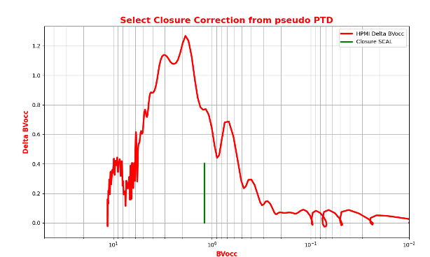
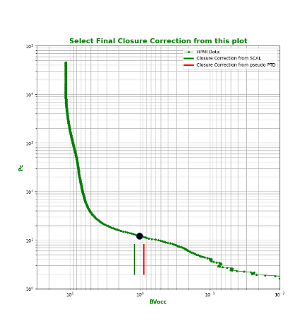
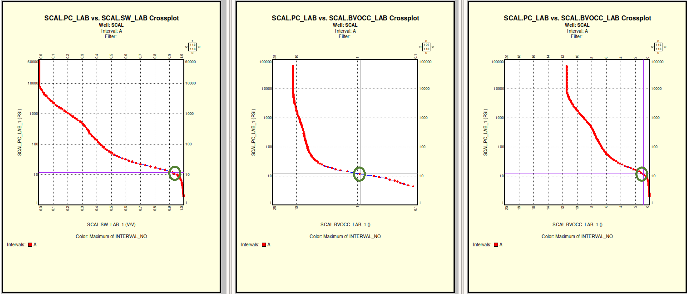
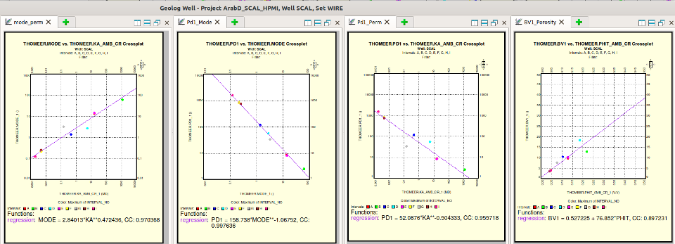

# Geolog-Used-to-Model-Thomeer-Parameters-from-High-Pressure-Mercury-Injection-Data
This repository contains a complete compressed (zipped) Geolog Project that is used to model SCAL High Pressure Mercury Injection (HPMI) core data using Thomeer Capillary Pressure parameters. 
---
### Updated January 29, 2022 with python 'try' implementation and calculations of error, Thomeer perm and the exact Mode of Pore Thoat Distribution in Microns (diameter). This project now has a number of HPMI samples that can be used as a demonstration of the Geolog python loglans used in this process. We have added an option to create a *.png image for for each of the Final Plots for each sample too. We also have a new workflow for picking the Closure Correction (CC).  

### Our Thomeer Workflow has all of the Closure Corrections for each sample as a curve called Closure in the SCAL set. We think it is best to use a number of cross plots in Geolog to pick the initial Closure Correction estimate from the HPMI data up front before starting on the Thomeer Analysis. We also have a curve called NO_PORE_SYS that is used to instruct the python loglan as to how many pore systems to solve for in this process. 

### To pick our final Closure Correction (CC) we start the original CC that we just recorded in the SCAL set, but it is missing an important plot that is shown below. Normally you would plot a Pore Throat Distribution (PTD) that would have microns on the x axis and Delta BVocc on the y axis where the x axis is calculated: 

	microns =  ((2.0 * 367.0)/(Pc_r[i] * 69035.0)) * 10000.0

However, then you would not be able to directly choose a Closure Correction in pu from this plot. Therefore, in the plot below we have created a pseudo PTD by plotting BVocc on the x axis in pu and Delta BVocc on the y axis also in pu. You select what appears to be a representative CC from this plot too. 

The intial CC from the SCAL set Closure curve is shown as the green line. We also picked a CC estimate from the pseudo PTD plot above using the CC results recorded as Closure from the SCAL set to help guide us. 

The plot below shows how we pick the final CC. We have the first recorded CC from the SCAL set, and we have a CC from the pseudo PTD. We make our final CC pick guided by our previous two CC estimates, and then proceed with the Thomeer parameter analysis. This method to pick the final CC appears to be the best to use for our analysis. 

To use this option use the loglan option PICK_CC = 'PICK', or you can use your inital Closure from the SCAL set by using a PICK_CC = 'SCAL'. 

	- TIP: In this process you read the HPMI from the SCAL set and you write your Thomeer parameters, Core data and Closure to the Thomeer set. If you are satisfied with your Closure Corrections, then we would copy the Thomeer.Closure curve as the SCAL.Closure curve. 
	- If you want to make another run at the analysis then use PICK_CC = 'SCAL' and re-use your final Closure Corrections now coming from the SCAL set. 

### In this new loglan we also have an Automatic option (‘YES’,’NO’) that if Auto=‘NO’, then the python loglan will allow you to make your own picks for the following Thomeer parameters that are used as seeds to the process:

      1) Pd1 (Closure Correction is already input as a curve). If Auto='YES', then Pd1 is automatically picked. 
      2) BV1 & Pd2 if there are 2 Pore Systems used in Auto = 'NO' or 'YES'.

### Again, if Auto = 'YES' and your sample has 2 pore systems, then you would still need to pick BV1 and Pd2 from item #2 above. 

### Please consider all of this work in progress, and your feedback is welcome.
---
## Introduction:
This GitHub repository uses python loglan code to load High Pressure Mercury Injection (HPMI) Core data directly from the SCAL set in a Geolog Well and then model the HPMI data using a Thomeer hyperbola by our estimations of the Thomeer Capillary Pressure parameters as shown below. Ed Clerke used a similar method in Excel with Solver to estimate his Thomeer parameters for each HPMI sample that went into the Rosetta Stone Arab D Carbonate Thomeer database. We have also used fminsearch in Matlab too, but with this repository we are able to use Geolog to perform the modeling of the HPMI data. The purpose of this Geolog project is to serve as an example that will allow the user to build their own reservoir-specific core calibration database for their Reservoir Characterization studies. 

## How it Works:
The following animated image illustrates the process in Geolog. We start with the original HPMI data. The first step is to locate the point on the HPMI curve that represents the point where real matrix data begins and not the HPMI data representing surface conformance around the plug sample. We now believe that the best way to pick the Closure Correction is discussed above, but our first estimate comes from the cross plots below: 

For the second step we pick the point for the Bulk Volume porosity of the first pore system (BV1) as well as the Initial Displacement Pressure for the second pore system (Pd2) if available from the sample data.

The third step is to select the Total porosity for the HPMI data called BVtotal where the porosity of the second pore system is called BV2:

      BV2 = BVtotal - BV1

This program uses Scipy Optimize curve_fit to estimate the appropriate Thomeer parameters necessary to model the HPMI data. The points selected from the GUIs are used to estimate the boundary conditions for these estimations, and the estimations for a typical example are shown below where we have two pore systems available in the sample. 

    **Thomeer Parameters Estimated from Imported HPMI Data:**
        Pd1 = 8.67  ,  G1 = 0.54 , BV1 = 10.13
        Pd2 = 389.1 ,  G2 = 0.24 , BV2 = 4.8

In the image below we are showing the correlations between the different Thomeer parameter data. The first cross plot on the left shows the correlation between the Mode of the Pore Throat Distribution (PTD) called Mode vs. Core Permeability with a correlation coefficient of 0.97. The exact Mode of the PTD in microns can be calculated from the Thomeer parameters G1 and Pd1 using the Buiting equation below:
 
 	Mode(microns) = exp(-1.15*G1)*(214/Pd1)

Most of the different rock typing techniques (r35, FZI ....) are trying to approxiamate the most dominant pore throat, but the Buiting Mode equation gives the user the exact Mode of the PTD.

The second cross plot from the left shows the correlation of the Mode vs. Pd1 with a correlation coefficient of 0.99. We can model the Thomeer parameters using core calibrated permeability from logs. 

## Reservoir Characterization Workflow:
We now have numerous HPMI samples in this Geolog project in the SCAL set. In Geolog we first read-in the Capillary Pressure (Pc) data directly from the Well, perform our Thomeer analysis on each sample and then write the results back to Geolog. We use this process to build our own sample-by-sample core calibration database. After all the Thomeer analysis would be performed, then we would then use these results in a Reservoir Characterization workflow similar to what we employed in the following GitHub repository. Of course, we would alter the workflow to employ our own new reservoir-specific calibration data for our Reservoir Characterization studies.

https://github.com/Philliec459/Geolog-Used-to-Automate-the-Characterization-Workflow-using-Clerkes-Rosetta-Stone-calibration-data

In the above workflow example, we used hundreds of HPMI samples as calibration data. In the image below we are showing a Porosity vs. Permeability cross plot in the upper left for all the calibration samples used in Ed Clerke's Rosetta Stone calibration data for the Arab D reservoir. The colors represent different Petrophysical Rock Type (PRT) as defined by Clerke. In this example we select a small group of poro-perm samples, and then the Pc curves from this small group of selected samples is then shown in the lower left. The black Pc curve is the upscaled Pc curve from the selected samples, and the black bars in the histograms represent the median value for the selected samples. We would be using the upscaled Pc curves that vary level-by-level in the well to model saturations over a vast range of reservoir quality rock along the wellbore.

## Modeling of Saturations Using Thomeer Capillary Pressure Parameters: 
Also, the following image shows one example from our modeling of saturations from Capillary Pressure vs. log analysis. The match is very good. I personally have performed this type of characterization on at least 30 huge carbonate oil fields in Saudi, and the results shown below are very typical.

---
1 Clerke, E. A., Mueller III, H. W., Phillips, E. C., Eyvazzadeh, R. Y., Jones, D. H., Ramamoorthy, R., Srivastava, A., (2008) “Application of Thomeer Hyperbolas to decode the pore systems, facies and reservoir properties of the Upper Jurassic Arab D Limestone, Ghawar field, Saudi Arabia: A Rosetta Stone approach”, GeoArabia, Vol. 13, No. 4, p. 113-160, October 2008.
