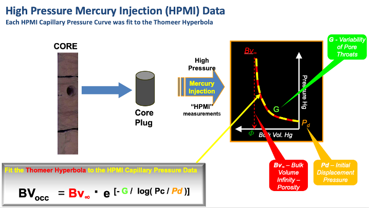

# Geolog-Used-to-Model-Thomeer-Parameters-from-High-Pressure-Mercury-Injection-Data
This repository contains a complete zipped (compressed) Geolog Project that is used to model SCAL High Pressure Mercury Injection (HPMI) core data using Thomeer Capillary Pressure parameters. 
## Note: This Geolog project is new as of January 15, 2022 and contains the newest refinements to our Thomeer Capillary Pressure parameter modeling.

## Introduction:
This GitHub repository uses python code to import High Pressure Mercury Injection (HPMI) Core data directly from Geolog and then use a Thomeer hyperbola to model the Thomeer Capillary Pressure parameters as shown below. Ed Clerke used a similar method in Excel with Solver to estimate his Thomeer parameters for each HPMI sample that went into the Rosetta Stone Arab D Carbonate Thomeer database. In the past we have also used fminsearch in Matlab, but with this repository we are now able to use Geolog to perform the modeling of the HPMI data. We have used these types of software to establish our own Reservoir Characterization Reservoir-Specific core calibration databases in the past for a reservoir-specific studies.

## How it Works:
The following animated image illustrates how this software operates. We start with the original HPMI data. The first step is to locate the point on the HPMI curve that represents the point where real data begins and not the HPMI data representing surface conformance around the plug sample. We also select the Initial Displacement Pressure (Pd1) for the sample for the first pore system too. We find that most carbonate rocks have bi-modal pore throat distributions representing two pore systems as shown in the example below. The selection of this point is performed with just a click on the Graphical User Interface (GUI) where this occurs. 

For the second step we pick the point for the Bulk Volume porosity of the first pore system (BV1) as well as the Initial Displacement Pressure for the second pore system (Pd2).

The third step is to select the Total porosity for the HPMI data called BVtotal where the porosity of the second pore system is called BV2:

      BV2 = BVtotal - BV1

This program uses Scipy Optimize curve_fit to estimate the appropriate Thomeer parameters necessary to model the HPMI data. The points selected from the GUIs are used to estimate boundary conditions for these estimations, and the estimations for this example are shown below:

    Thomeer Parameters Estimated from Imported HPMI Data:
        Pd1 = 8.67  ,  G1 = 0.54 , BV1 = 10.13
        Pd2 = 389.1 ,  G2 = 0.24 , BV2 = 4.8

## Reservoir Characterization Workflow:
We are now using the HPMI data from a number of samples in this project. Our objective develop this code using a Geolog python loglan. In Geolog we will read the Pc data in from the SCAL data stored in a Well and write the results for each sample back to Geolog to build our sample-by-sample core calibration database. We would then use the carbonate characterization workflow as employed in our following GitHub repository but alter the workflow to employ our own new reservoir-specific calibration data for our reservoir characterization.

https://github.com/Philliec459/Geolog-Used-to-Automate-the-Characterization-Workflow-using-Clerkes-Rosetta-Stone-calibration-data

In the above workflows we have used hundreds of HPMI samples as calibration. In the image below we are showing the Porosity vs. Permeability cross plot in the upper left for all the calibration samples used for the Arab D reservoir; all colored by Petrophysical Rock Type. We select a small group of poro-perm samples, and the Pc curves from this small group of selected samples is then shown in the lower left. The black Pc curve is the upscaled Pc curve from the selected samples,and the black bars in the histograms are the median value for the selected samples. We would be using upscaled Pc curves that varies level by level in the well to model saturations because of the changing reservoir quality along the wellbore.

## Modeling of Saturations Using Thomeer Capillary Pressure Parameters: 
Also, the following image shows one example from our modeling of saturations from Capillary Pressure vs. log analysis. The match is very good. I personally have performed this type of characterization on at least 30 huge carbonate oil fields in Saudi, and the results shown below are very typical.

1 Clerke, E. A., Mueller III, H. W., Phillips, E. C., Eyvazzadeh, R. Y., Jones, D. H., Ramamoorthy, R., Srivastava, A., (2008) “Application of Thomeer Hyperbolas to decode the pore systems, facies and reservoir properties of the Upper Jurassic Arab D Limestone, Ghawar field, Saudi Arabia: A Rosetta Stone approach”, GeoArabia, Vol. 13, No. 4, p. 113-160, October, 2008.
